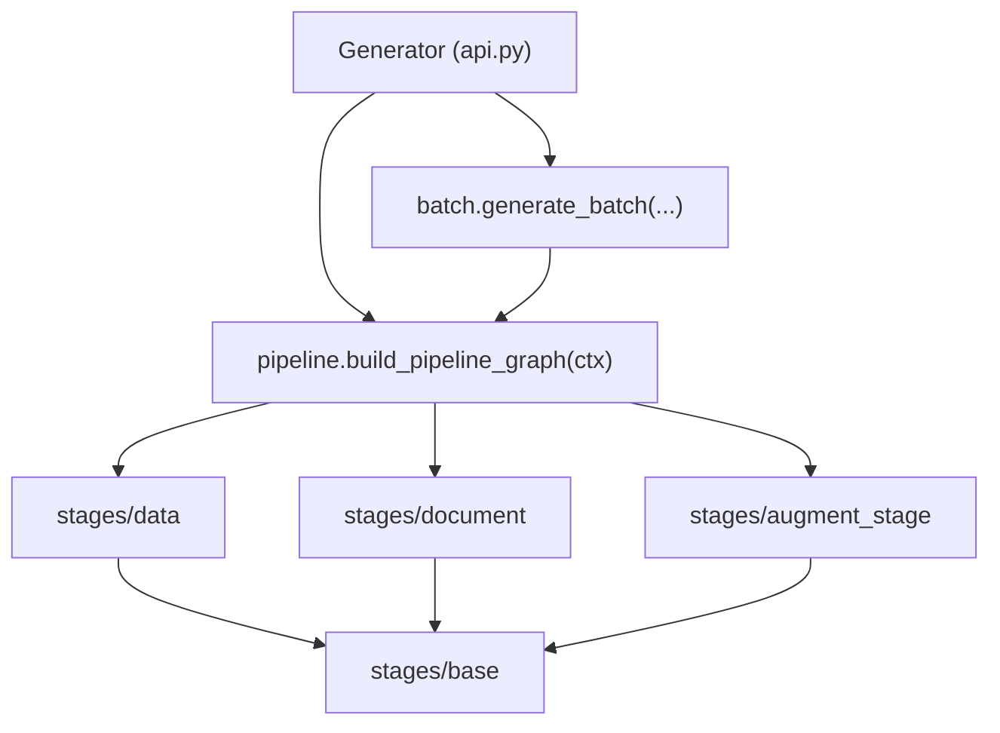
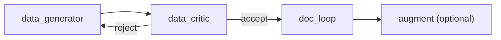
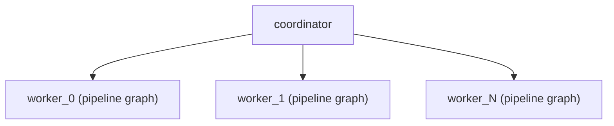

# Architecture

seed-data is organized as a set of **pipeline stages** wired into
[Strands Agents](https://strandsagents.com/) graphs, with a thin typed Python API
(`Generator`) on top. This page explains how the pieces fit together.

## The big picture



- **`Generator`** (`api.py`) — the public front door. Holds configuration once;
  its verbs (`generate`, `generate_batch`, `generate_packet`) build and run graphs.
- **`stages/`** — one module per generate+critique pair, plus a shared foundation.
- **`stages/base.py`** — the typed primitives every stage uses.

## Stages

The document pipeline is a chain of stages. Each stage **pairs a generator with a
critic** in one module, because they evolve together and share context:

| Stage module | Generator | Critic |
| --- | --- | --- |
| `stages/data.py` | invents schema-conforming JSON | JSON-Schema validation (code) + LLM domain/arithmetic judgment |
| `stages/document.py` | writes HTML/ReportLab and renders a PDF | render guard (code) + vision-model layout judgment; owns the render **loop** |
| `stages/augment_stage.py` | applies augraphy aging effects | file relocation (code) + legibility judgment |

Each critic is a **deterministic guard followed by an LLM judgment**. The guard is
plain Python (exact, free, fast — e.g. JSON-Schema validation catches structural
errors before spending a single token); the LLM only judges what code cannot
(realism, layout, legibility).

## The shared foundation (`stages/base.py`)

Four primitives hold everything together:

### `StageContext`

A pydantic object carrying everything a stage needs for **one document**: the
schema, steering text, sample PDFs, the resolved output paths (`output_path`,
`data_json_path`, `script_path`), and the run configuration (models, threshold,
renderer). It is **bound into each node at build time** — see
[Self-contained graphs](#self-contained-graphs).

### `ModelConfig`

Which model each agent uses (`data`, `doc`, `critic`, `aug`, `batch`). Per-field
defaults mean `ModelConfig(doc="gpt-oss")` overrides only the doc model.

### `Verdict`

The structured result every critic returns — `accepted`, `score`, `summary`,
`feedback`, `issues`. It replaces stringly-typed control flow: edge conditions
call `accepted("node")` / `rejected("node")`, which parse the `Verdict` out of the
node's output rather than grepping free text. A critic serializes its verdict with
`as_node_text()` (a `verdict:accepted|rejected` marker line plus JSON), and
`verdict_of(state, node)` reads it back via the canonical
`NodeResult.get_agent_results()` accessor (works for both live `GraphState` and the
final `GraphResult`).

### `FunctionNode`

A custom Strands graph node that runs a deterministic Python function — the
sanctioned pattern for hybrid AI + business-logic workflows. The critics are
`FunctionNode`s: they do code work (validation, file moves), then call an LLM, then
return a `Verdict`. The context is bound at construction: `FunctionNode(func, name,
ctx=ctx)`.

## Self-contained graphs

The most important design decision: **a pipeline graph carries no external state.**

Every node — generator agents and `FunctionNode` critics alike — has its
`StageContext` baked in when it is built. A stage builder takes `ctx`:

```python
data.build_generator(ctx)     # agent configured from ctx
data.build_critic(ctx)        # FunctionNode with ctx bound
document.build_loop(ctx)      # nested render-loop graph, all nodes hold ctx
```

`pipeline.build_pipeline_graph(ctx)` assembles these into a complete
`data → data_critic → doc_loop → (augment)` graph. Because the graph needs no
`invocation_state` injected at run time, it can be **invoked directly** *or*
**composed as a node inside a larger graph** — which is exactly what batch does.

This is why there are no environment-variable side-channels, no closures capturing
orchestrator locals, and no module-global state: configuration flows as a typed
object bound into the graph structure itself.

## Single-document flow



`pipeline.generate(...)` builds the context, builds the self-contained graph,
invokes it, and returns a typed `GeneratedDoc` (`pdf_path`, lazy `.data` label,
`verdict`, `score`, `token_usage`).

## Batch flow — concurrent fan-out

Batch is **just a graph**. A planner turns one brief into N scenarios; each scenario
gets its own `StageContext` (own paths, own `doc_id`) and its own self-contained
pipeline graph, added as a **sibling node** under a coordinator:



Strands runs the siblings **concurrently, natively** — no threads, no manual pool,
no shared mutable state to collide on (each worker reads and writes only its own
paths). This is possible precisely *because* each pipeline graph is self-contained.

## The public API (`api.py`)

`Generator` is a thin, typed facade — it holds configuration and delegates to the
stage graphs:

```python
from seed_data import Generator, ModelConfig, Schema

gen = Generator(models=ModelConfig(doc="gpt-oss", critic="haiku"), threshold=5)

gen.generate("invoice", scenario="Midwest distributors")   # -> GeneratedDoc
gen.generate_batch("invoice", count=10, scenario="...")     # -> BatchResult
```

`generate()` accepts a **bundled schema name**, a **directory path**, or an in-code
[`Schema`](#defining-a-document-type-in-code).

### Defining a document type in code

A `Schema` is a document type defined without files on disk — a JSON-Schema dict
**or** a pydantic model (rendered to JSON Schema), plus generation guidance and
optional sample PDFs:

```python
from pydantic import BaseModel
from seed_data import Schema

class Invoice(BaseModel):
    invoice_number: str
    total: float

schema = Schema(name="invoice", model=Invoice,
                generation_guidance="Totals must equal the sum of line items...")
gen.generate(schema)
```

## One pipeline, three entry points

The staged pipeline (`stages/`) is the single architecture behind all three
capabilities. Single-document and batch generation call it directly; packet
generation (`packet.py`) is a thin coordinator that also drives each sub-document
through the same `seed_data.stages.pipeline.generate`.
