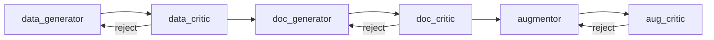

# Synthetically Engineered Evaluation Data

**Synthetically Engineered Evaluation Data (SEED)** is an AI-powered synthetic document generation pipeline. It turns a JSON schema into a realistic PDF document, validates it through multi-stage critique loops, and emits a paired ground-truth JSON label. The result is benchmark data for Intelligent Document Processing (IDP) systems: OCR, Key Information Extraction (KIE), and document classification.

Every document is entirely fictional. Names, addresses, and financial figures are invented, and each PDF is rendered from freshly generated HTML/CSS (or ReportLab) code, so there are no real documents or templates copied into the output.

The pipeline is built on the [Strands Agents SDK](https://strandsagents.com/) and calls foundation models through Amazon Bedrock.

## Quickstart

Install from PyPI — the default renderer is pure Python, so there is nothing else to set up:

```bash
pip install seed-data
```

Configure AWS Bedrock credentials, then generate a document from either the command line or the Python API. Both produce the same artifacts.

**From the command line:**

```bash
export AWS_PROFILE=your-profile-name

# Copy the built-in schemas into a local, editable folder
seed-data clone-schema-library ./schemas

# Generate an invoice PDF + ground-truth JSON into ./output
seed-data --schema-dir ./schemas/invoice --output ./output
```

**From Python:**

```python
from seed_data import Generator, ModelConfig

gen = Generator(models=ModelConfig(doc="gpt-oss", critic="haiku"), threshold=5)
doc = gen.generate("invoice", scenario="Midwest food-distributor invoice")

print(doc.pdf_path)   # the rendered PDF
print(doc.data)       # ground-truth JSON label (dict)
```

Either path writes three paired artifacts into the output directory — the ground-truth JSON label, the HTML the renderer used, and the final PDF:

```text
output/
├── data/<id>.json                 # ground-truth data / label
├── generation_scripts/<id>.html   # render source
└── pdfs/<id>.pdf                  # final document
```

Browse the schema library on GitHub:
[awslabs/…/schemas](https://github.com/awslabs/synthetically_engineered_evaluation_data/tree/main/src/seed_data/schemas).

[:octicons-arrow-right-24: Full quickstart](Getting-Started/quick-start.md)

---

## How It Works

Each document flows through a chain of agents. Generation stages produce content and rendering; critic stages review the output and can reject it, sending the pipeline back for another attempt (bounded by `--max-attempts`). Augmentation stages are optional and run only with `--augment`.



The **data generator** produces JSON data from the schema, the **data critic** validates it against the schema and domain rules, the **doc generator** writes HTML/CSS and renders a PDF, and the **doc critic** uses a vision model to evaluate layout, typography, truncation, and math. With `--augment`, the **augmentor** applies aging effects via augraphy and the **aug critic** checks that the result is still legible.

Batch and packet runs wrap this single-document pipeline. A batch runs N scenarios in parallel from one diversity brief. A packet coordinates several different document types that share context (same person, address, and dates) and merges them into one multi-document PDF.

### Key Use Case: Evaluation Data for IDP and KIE

Benchmarking a document understanding system requires paired data: an input document and the exact ground truth it should extract. Collecting real documents is slow, and real documents carry PII and redistribution constraints. SEED generates the pair directly: a schema defines the structure, the pipeline invents realistic fictional data, renders it to a PDF, critiques the render, and saves the source data JSON as the ground-truth labels. Add image augmentation to simulate scanning and faxing artifacts, and you have a controllable, reproducible evaluation set.

---

<div class="grid cards" markdown>

-   **Getting Started**

    ---

    Install SEED, configure AWS Bedrock credentials, and generate your first document and batch.

    [:octicons-arrow-right-24: Get started](Getting-Started/README.md)

-   **Guides**

    ---

    Create a document type, run batches, build multi-document packets, and control per-document variation.

    [:octicons-arrow-right-24: Read the guides](Guides/README.md)

-   **Advanced**

    ---

    Available models and model-agnostic design, PDF renderers, and image augmentation.

    [:octicons-arrow-right-24: Go deeper](Advanced/README.md)

-   **API Reference**

    ---

    The `Generator` Python API, `Schema`, typed results, and module-level docs for packets, critique, tools, and utilities.

    [:octicons-arrow-right-24: Browse the API](API-Reference/README.md)

</div>
